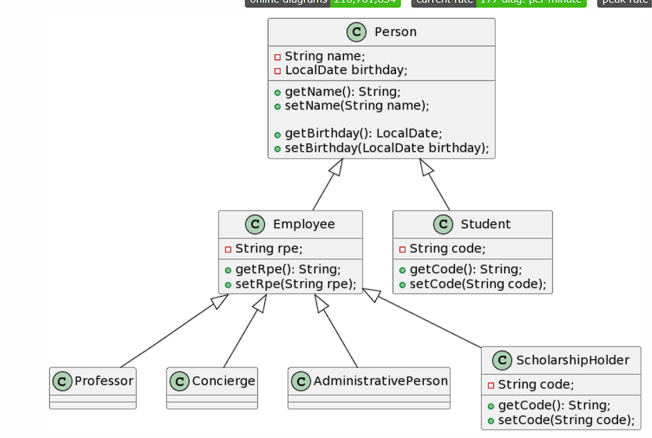

HERENCIA:   
la herencia en java es la forma en que se heredan atributos o metodos de una clase padre a una clase hijo 
y se expresa con la parabra reservada "extends"
la herencia multiple serefiere a cuando una clase hereda de dos clases distintas al mismo tiempo, 
el ejemplo que vimos en clase fue cuando se presento que la clase 
ScholarshipHolder podia Heredar de studen pero a la ves de employee por lo que tubimos que decidir 
solo una para que fuera su clase padre ya que no se permite la herencia multiple y nos aparece esto 
al intentarlo "Class cannot extend multiple classes" ya que no soporta este tipo de herencia 

